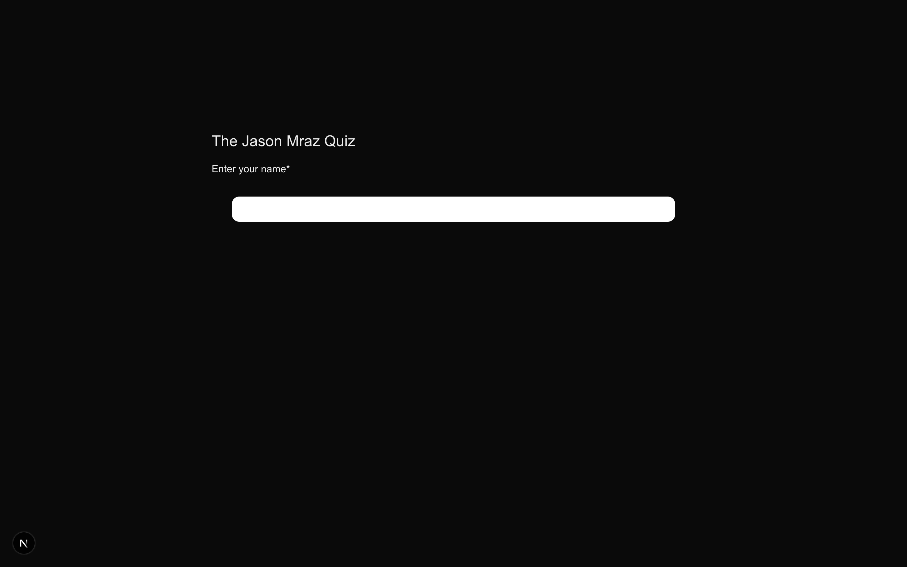
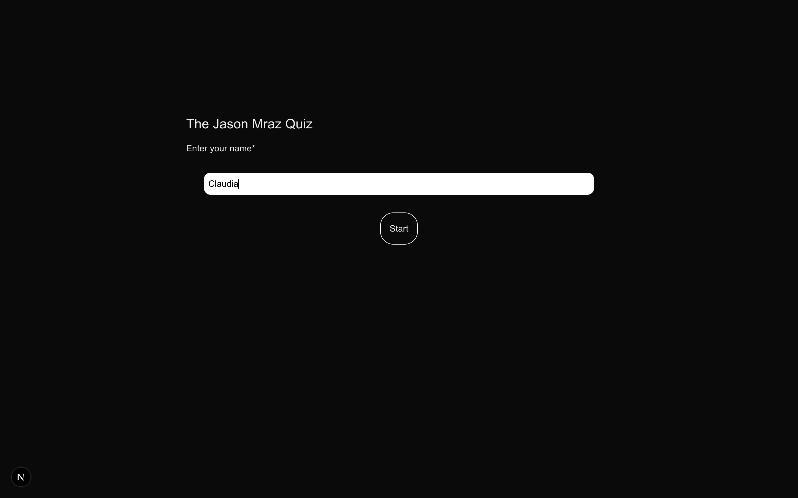
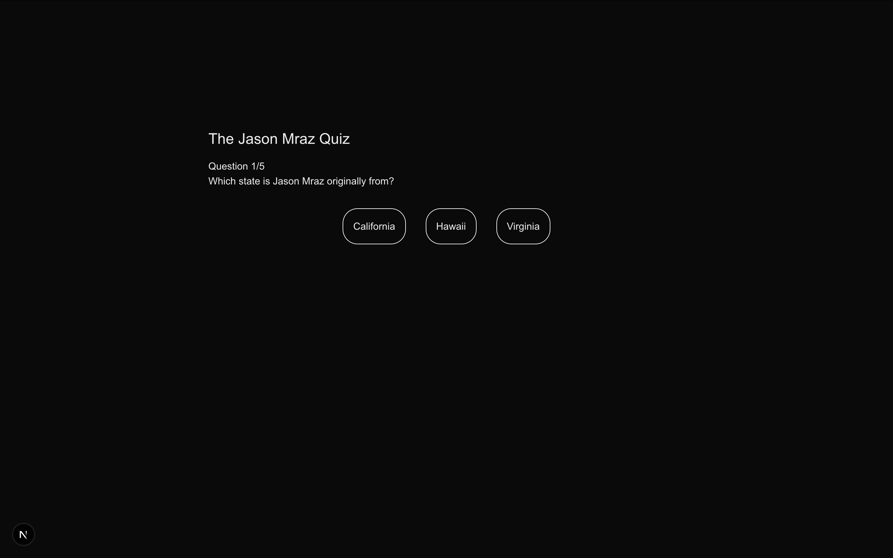
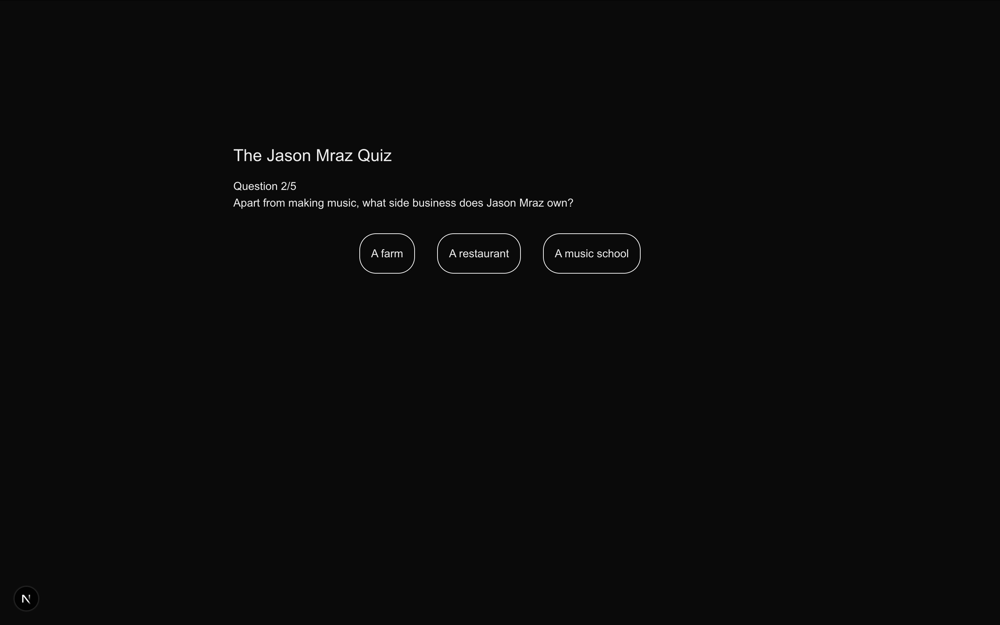
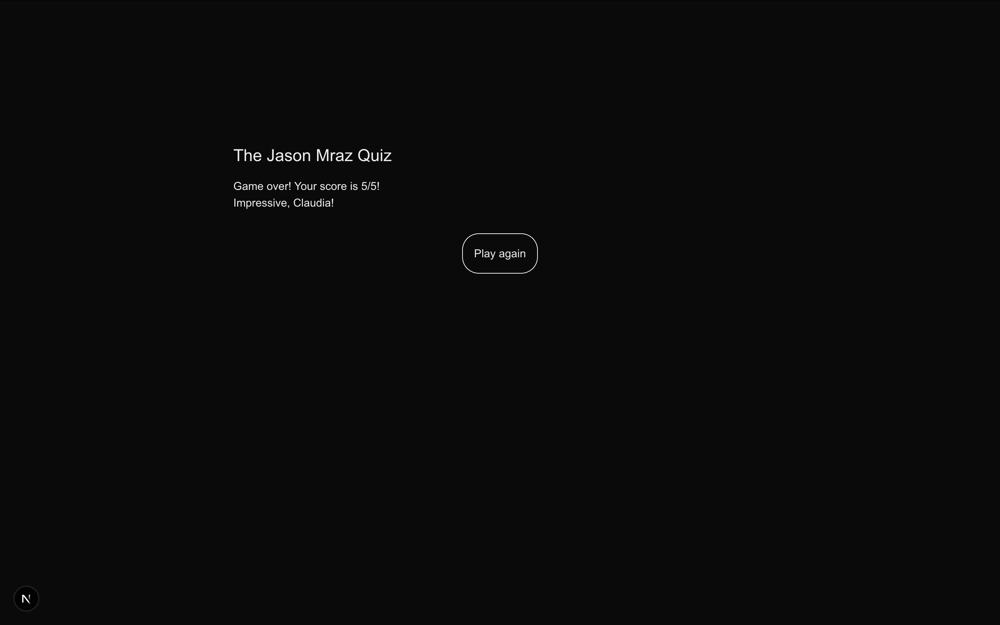

# Jest Testing - The Sweden World Cup 2026 Quiz

This quiz was originally about Jason Mraz by Claudia. I changed it to a Sweden World Cup 2026 "guess the score" quiz. But the features stay the same as the original, except with different questions and styling. No additional tests were required. 

### Features

- Name input before starting
- Five multiple choice questions with three possible answers each
- A progress indicator showing which question the user is answering
- Score tracking that is displayed at the end of the quiz
- Different messages based on the score followed by the username
- Option to play again

### Functionality

On page load, the user will see the title, instructions, and an input box. There is no start button.   

  

After the user starts typing, the start button will appear and the user can click Start to start the quiz.

  

After clicking Start, the user will see the first question with three answer options.

  

After clicking an answer, the user will be taken to the next question. The progress indicator will also update to show which question the user is answering.

  

There are currently a total of five questions. After answering the last question, the user will be taken to the results screen. They will see their final score, a message based on their score (0-2 / 3-4 / 5) along with their username. There is also a Play Again button that will take the user back to the first question.

  

